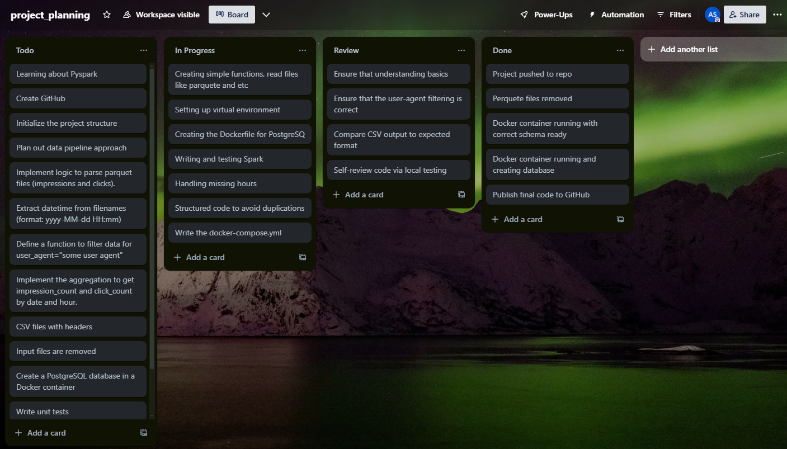

# 🔄 Adform Data Engineering Project

## 📋 Overview
This project implements a **simple data processing pipeline** that handles impression and click data processes. It using **PySpark**, and loads it into a **PostgreSQL**. The pipeline is designed to process parquet files containing advertising impression and click data, aggregate them by hour and store the results in a database for client reporting.

## 🎯 Project Planning
 https://trello.com/invite/b/679246f32031ab106517da0d/ATTI0b7f07f181d94d4a27a8fe722fd5acfcB5A890B5/projectplanning


## 📂 Project Structure
```
ADFORM_SPARK_APP/
│
├── .cadence/
├── .idea/
├── .pytest_cache/
├── .venv/
├── .vscode/
├── docker/
│   ├── init/
│   │   ├── 01-init-db.sql
│   │   ├── __init__.py
│   └── docker-compose.yml
├── hadoop/
├── htmlReport/
├── jupyter_files/
├── logs/
├── output/
├── raw_data/
├── src/
│   ├── Task1/
│   │   ├── __init__.py
│   │   └── data_processing.py
│   ├── Task2/
│   │   ├── __init__.py
│   │   └── warehouse.py
│   ├── __init__.py
│   ├── utils.py
│   
├── tests/
│   ├── __init__.py
│   ├── test_client_report_etl.py
│   └── test_data_processing.py
├── .env
├── .gitignore
├── config.py
├── deploy.sh
├── main.py
├── project_planning.png
├── README.md
└── verify_setup.py
└── requirements.txt

```

## 🛠️ Prerequisites
- **Python** 3.8 or higher
- **Docker Desktop**
- **Java 11** (for Apache Spark)
- **Git**

## 🚀 Setup Instructions

## ⚙️ Deployment Configuration

### 🕒 Scheduled Execution
The application supports different scheduling configurations through cron jobs. You can set the environment in your `.env` file:

```bash
# For production (runs every 6 hours)
CRON_ENVIRONMENT=production

# For development (runs every 5 minutes)
CRON_ENVIRONMENT=development

# For testing (runs every minute)
CRON_ENVIRONMENT=testing
```

Schedule details:
- **Production**: Runs at 00:00, 06:00, 12:00, and 18:00 (`0 */6 * * *`)
- **Development**: Runs every 5 minutes (`*/5 * * * *`)
- **Testing**: Runs every minute (`* * * * *`)

### 🐳 Docker Configuration
The application uses a multi-container setup with Docker Compose:

```yaml
services:
  postgres:
    image: postgres:14
    container_name: adform_warehouse
    ports:
      - "5432:5432"
    volumes:
      - postgres_data:/var/lib/postgresql/data
    healthcheck:
      test: [ "CMD-SHELL", "pg_isready" ]
      interval: 10s

  pyspark_processor:
    build:
      context: ..
      dockerfile: docker/Dockerfile
    container_name: adform_spark
    volumes:
      - ../raw_data:/app/raw_data
      - ../output:/app/output
    depends_on:
      postgres:
        condition: service_healthy
```

### 🪟 Windows Setup
**Install Prerequisites**:
1. Install Prerequisites:
- Install Python 3.8+ from python.org
- Install Docker Desktop for Windows
- Install Java 11 JDK
- Set JAVA_HOME environment variable

2. Clone the repository:
   ```bash
   git clone <repository-url>
   cd adform_spark_app
   ```

3. Create and activate virtual environment:
   ```bash
   python -m venv venv
   .\venv\Scripts\activate
   ```

4. Install dependencies:
   ```bash
   pip install -r requirements.txt
   ```

5. Configure environment variables:
   Create a .env file with the following content:
   ```
   POSTGRES_USER=adform_user
   POSTGRES_PASSWORD=adform_pass
   POSTGRES_DB=adform_db
   DB_HOST=localhost
   DB_PORT=5432
   ```
   For docker-compose.yml file, use the following:
    ```
    POSTGRES_DB=adform_db
    POSTGRES_USER=adform_user
    POSTGRES_PASSWORD=adform_pass
    DB_HOST=postgres
    DB_PORT=5432
    ```

### 🏃 Running the Application
1. **Place input parquet files** in the raw_data directory
2. **Run the application**:
   ```bash
    python main.py --user-agent "some user agent"
   ```

### 🍎 macOS/Linux Setup
1. Install Prerequisites:
   ```bash
   # macOS (using Homebrew)
   brew ins105:    ```

### 🐧 Linux Deployment
The application can be quickly deployed using our automated deployment script:

1. **Clone the Repository**:
   ```bash
   git clone <repository-url>
   cd adform_spark_app
   ```

2. **Make the Deploy Script Executable**:
   ```bash
   chmod +x deploy.sh
   ```

3. **Run the Deployment Script**:
   ```bash
   ./deploy.sh
   ```
   
   To include initial testing, use:
   ```bash
   ./deploy.sh --test
   ```

The deployment script automatically:
- Checks and installs system requirements
- Sets up Python virtual environment
- Installs dependencies
- Configures environment variables
- Starts Docker containers
- Sets up the database

4. **Running the Application**:
   After deployment, run the application using:
   ```bash
   ./main.py --user-agent "some user agent"
   ```

5. **Monitoring Logs**:
   View application logs in real-time:
   ```bash
   tail -f logs/app.log
   ```
## 💾 Data Engineering Process

### 1. 📥 Data Extraction
- **Source**: Raw parquet files
- **Content**: Impressions and clicks data
- **Format**: Parquet

### 2. 🔄 Data Processing (ETL)
- **Technology**: PySpark
- **Processing Steps**:
  - Data validation
  - Aggregation
  - Quality checks

### 3. 📊 Simple Data Warehouse
- **Technology**: PostgreSQL
- **Implementation**: Docker container
- **Schema Design**:
  ```sql
  CREATE TABLE adform_dw.client_report (
      datetime TIMESTAMP NOT NULL,
      impression_count BIGINT NOT NULL,
      click_count BIGINT NOT NULL,
      audit_loaded_datetime TIMESTAMP NOT NULL,
      PRIMARY KEY (datetime)
  );
  ```

## ✅ Task Requirements and Implementation Status

### Task 1: Data Processing 📊
- [x] Create application to calculate impressions and clicks
- [x] Filter data for specific user-agent
- [x] Generate CSV output files
- [x] Fill missing hours with zero values
- [x] Process and remove input files

### Task 2: Database Implementation 💽
- [x] Create PostgreSQL in Docker
- [x] Implement schema and tables
- [x] Data loading application
- [x] Optimization and monitoring

## 📈 Performance Monitoring
- **Logging**: Detailed logs in `/logs/app.log`
- **Coverage report metrics**: 61% Detailed test report `htmReport/index.html` 

## 🧪 Testing
```bash
python -m pytest tests/
```

## 📚 Documentation Resources
- **Resources**: Books, YouTube channels, DataCamp and Codecademy
- **Used Technologies**: Visual Studio Code, Docker, PySpark, PostgreSQL, Copilot, Trello, GitHub, Claude.ai
- **User Guide**: Files will be constantly uploaded to the raw_data directory and processed by the application to generate CSV output files. The data will be loaded into the PostgreSQL database for further analysis.

## 📅 Project Timeline
- **Start Date**: 2025-01-17
- **End Date**: 2025-01-23


